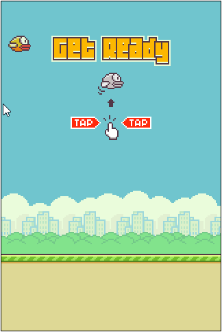
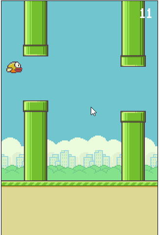
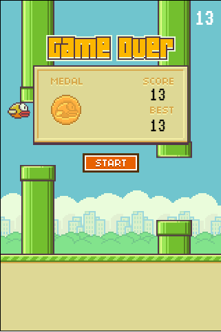
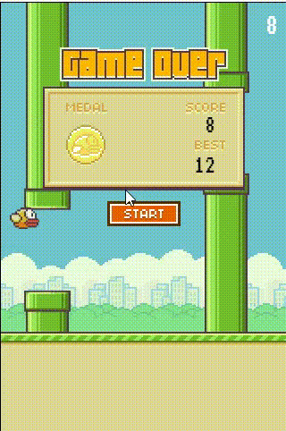

#  Flappy Bird


> Status do Projeto: :heavy_check_mark: Concluído


## Tópicos 

* [Sobre o projeto](#-sobre-o-projeto)
* [Demostração da Aplicação](#-demostração-da-aplicação)
* [Como rodar a aplicação](#-como-rodar-a-aplicação)
  * [Pré-requisitos](#pré-requisitos)
  * [Rodando a aplicação web](#rodando-a-aplicação-web)
* [Tecnologias](#-tecnologias)
* [Funcionalidades](#-funcionalidades)
* [Licença](#-licença)
* [Autora](#-autora)


## 💻 Sobre o projeto

O projeto é um clone do jogo Flappy Bird feito na linguagem Javascript a partir dos <a href="https://www.youtube.com/watch?v=jOAU81jdi-c&list=PLTcmLKdIkOWmeNferJ292VYKBXydGeDej">vídeos</a> do canal DevSoutinho
<br>
Acesse o <a href="https://github.com/omariosouto/flappy-bird-devsoutinho">repositório original do jogo</a>


## 🎨 Demostração da Aplicação

<p align="center">
  
  
  
</p>

<p align="center">
  
</p>

<p align="center">
  :sparkles:<a align="center" href="https://ariele-fatima.github.io/FlappyBird/">Acesse a aplicação clicando aqui</a>:sparkles:
</p>

## 🚀 Como rodar a aplicação

### Pré-requisitos
Não há necessidade de dependências ou libs para rodar a aplicação.

### Rodando a aplicação web
No terminal, clone o projeto: 

```
git clone https://github.com/ariele-fatima/FlappyBird.git
```

Duplo clique no arquivo index.html

## 🛠 Tecnologias

- [Javascript](https://developer.mozilla.org/pt-BR/docs/Web/JavaScript)
- [HTML](https://developer.mozilla.org/pt-BR/docs/Web/HTML)

## ⚙ Funcionalidades

:heavy_check_mark: Tela de início

:heavy_check_mark: Tela de Game Over

:heavy_check_mark: Som ao colidir

:heavy_check_mark: Parte visual feita utilizando canvas

## 📝 Licença

Esse repositório está licenciado pela **MIT LICENSE**. Para mais informações detalhadas, leia o arquivo [LICENSE](./LICENSE) contido nesse repositório.

## 🦸 Autora

Desenvolvido ❤️ por Ariele Fatima das Dores

[](https://www.linkedin.com/in/ariele-fatima-das-dores-057579191/) 

